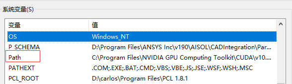
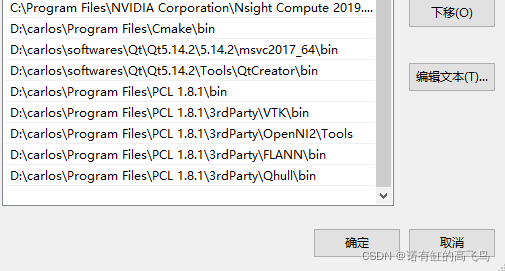
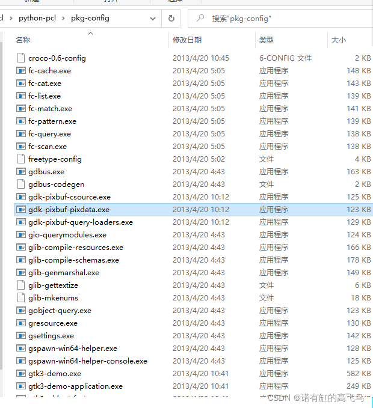
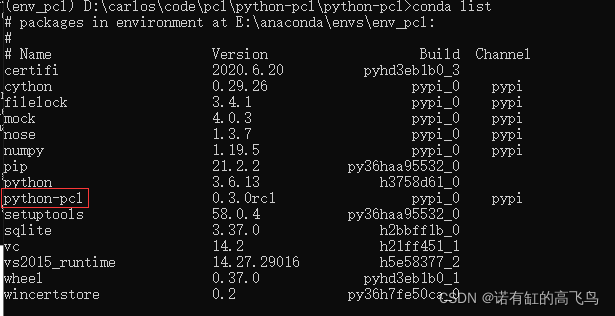
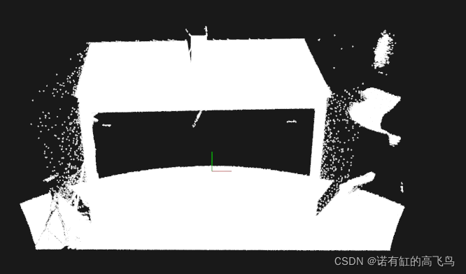

# python-pcl
Python bindings to the pointcloud library (pcl)
## install pcl181
download  installation package of pcl1.8.1\
[PCL-1.8.1-AllInOne-msvc2017-win64.exe https://github.com/PointCloudLibrary/pcl/releases/tag/pcl-1.8.1](https://github.com/PointCloudLibrary/pcl/releases/tag/pcl-1.8.1)

select a path for installation:\
here we install it in D:\carlos\Program Files\PCL 1.10.0
and install OpenNI in D:\carlos\Program Files\PCL 1.10.0\3rdParty\OpenNI2
## environment variable

find Advanced system settings in settings, and edit your envrionment variables\
these variabales should be here:\
OPENNI2_INCLUDE64: D:\carlos\Program Files\PCL 1.8.1\3rdParty\OpenNI2\Include\
OPENNI2_LIB64: D:\carlos\Program Files\PCL 1.8.1\3rdParty\OpenNI2\Lib\
OPENNI2_REDIST64: D:\carlos\Program Files\PCL 1.8.1\3rdParty\OpenNI2\Redist\
PCL_ROOT：D:\carlos\Program Files\PCL 1.8.1

If you don't have these variables here, add them manually\
then add following variabales to Path



>D:\carlos\Program Files\PCL 1.8.1\bin\
D:\carlos\Program Files\PCL 1.8.1\3rdParty\VTK\bin\
D:\carlos\Program Files\PCL 1.8.1\3rdParty\OpenNI2\Tools\
D:\carlos\Program Files\PCL 1.8.1\3rdParty\FLANN\bin\
D:\carlos\Program Files\PCL 1.8.1\3rdParty\Qhull\bin\



## clone python-pcl
```bash
git clone https://github.com/Noel-Gallagher-Highflyingbirds/python-pcl.git
cd python-pcl
```
download[Windows Gtk+ gtk+ -bundle_3.6.4-20130513_win64.zip](http://www.tarnyko.net/dl/gtk.htm),\
copy all files in "gtk+-bundle_3.6.4-20130513_win64/bin" into python-pcl/pkg-config \


```bash
conda deactivate
conda create -n env_pcl python=3.6 -y
conda activate env_pcl
pip install --upgrade pip --user
pip install cython==0.25.2
pip install numpy
python setup.py build_ext -i
python setup.py bdist_wheel
```

xxx.whl will be generated in python-pcl/dist

install
```bash
pip install .\dist\python_pcl-0.3.0rc1-cp36-cp36m-win_amd64.whl
conda list
```
then you see PCL in your conda virtual environment\


## test example

```python
python .\examples\visualization.py
```



## csdn
[https://blog.csdn.net/qq_41102371/article/details/122213998](https://blog.csdn.net/qq_41102371/article/details/122213998)
